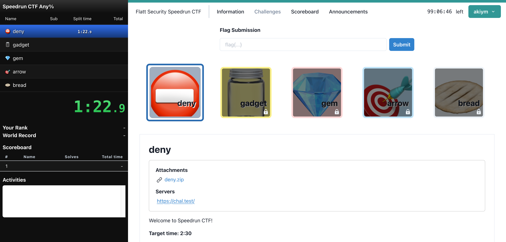

# Flatt Security Speedrun CTF

https://blog.flatt.tech/entry/code_blue_2023

| Challenge name | Category | Tag             | Author | Solves | Target time |                                                                                                                |
|----------------|----------|-----------------|--------|--------|-------------|----------------------------------------------------------------------------------------------------------------|
| deny           | web      |                 | akiym  |        | 2:30        | [Description](001/_chal/001.yml), [Attachment](001/_chal/deny.zip), [Source](001), [Solution](001/_solution)   |
| gadget         | web      | python          | akiym  |        | 5:00        | [Description](002/_chal/002.yml), [Attachment](002/_chal/gadget.zip), [Source](002), [Solution](002/_solution) |
| gem            | web      | ruby            | akiym  |        | 8:30        | [Description](003/_chal/003.yml), [Attachment](003/_chal/gem.zip), [Source](003), [Solution](003/_solution)    |
| arrow          | web      | dart            | akiym  |        | 10:00       | [Description](004/_chal/004.yml), [Attachment](004/_chal/arrow.zip), [Source](004), [Solution](004/_solution)  |
| bread          | web      | javascript, bun | akiym  |        | 13:30       | [Description](005/_chal/005.yml), [Attachment](005/_chal/bread.zip), [Source](005), [Solution](005/_solution)  |

