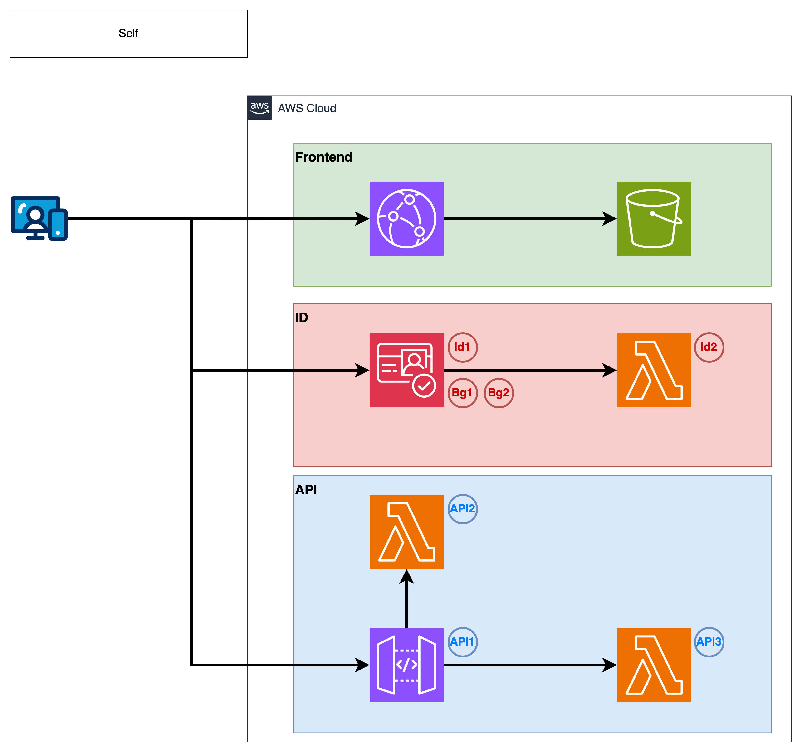

# 管理者画面

- [管理者画面](#管理者画面)
  - [構成図](#構成図)
  - [IdPStack](#idpstack)
    - [確認について](#確認について)
    - [権限の管理](#権限の管理)
    - [個別のデプロイ](#個別のデプロイ)
  - [ApiStack](#apistack)
    - [認可について](#認可について)
    - [ルーティングについて](#ルーティングについて)
    - [個別のデプロイ](#個別のデプロイ-1)
  - [WebStack](#webstack)
    - [構成について](#構成について)
    - [個別のデプロイ](#個別のデプロイ-2)
  - [WebDeployStack](#webdeploystack)
    - [個別のデプロイ](#個別のデプロイ-3)
  - [全体のデプロイ](#全体のデプロイ)

## 構成図



## IdPStack

Amazon User Poolを用いて、管理者ユーザーの管理を行う。

ユーザーの作成には、管理者が下記のコマンドを実行して追加を行う。

```bash
CLIENT_ID=<user-pool-client-id>
USERNAME=<username>
PASSWORD=<password>
aws cognito-idp sign-up \
  --region "ap-northeast-1" \
  --client-id $CLIENT_ID \
  --username  $USER_NAME \
  --password $PASSWORD \
  --no-sign-request
```

### 確認について

管理者が作成することからユーザーの登録時に検証等は行わず、ユーザーの確認状態を`CONFIRMED`とする。

確認は[lib/idp/index.ts](./lib/idp/functions/preSignUp.ts)を確認する。

### 権限の管理

APIで権限の確認を行うため、JWTに下記のクレームを含める必要がある。

- `custom:role` - ユーザーの権限を表す文字列

そのため、アプリケーションクライアントの設定で、`role`の読み込み権限を付与する。

設定には[cdk/lib/idp/index.ts](./lib/idp/index.ts)の`pivate createUserPoolClient()`を用いる。

- ToDo: Write権限の付与について、整理をする。

### 個別のデプロイ

```bash
$ cdk deploy idp-stack
```

## ApiStack

管理画面のAPIを提供する。

### 認可について

認可はAPI GatewayのCustom Authorizer(Lambda)を用いて行う。

認可の処理を行うLambdaは、[lib/api/index.ts](./lib/api/index.ts)の`private createAuthorizer()`を用いる。
内部で実行されるコードは、[lib/api/functions/authorizer.ts](./lib/api/functions/authorizer.ts)で記述する。

認可用のJWTは`Authorization: Bearer <JWT>`の形式で渡す。

テストを行う場合は、下記のコマンドを実行する。

```bash
API_ENDPOINT=<api-endpoint>
JWT=<jwt>

$ curl \
  $API_ENDPOINT/flag \
  -H "Authorization: Bearer ${JWT}"
```

### ルーティングについて

ルーティングはAPI GatewayのLambda Proxy Integrationを用いて行う。
主なRouteとしては `/v1` をPrefixとして、下記のものを用意する。

- `GET /v1/flag` - Flagを返す

Routeの集約は[lib/api/index.ts](./lib/api/index.ts)の`private route()`を用いる。
内部で実行されるコードは、[lib/api/functions/flag.ts](./lib/api/functions/flag.ts)で記述する。

### 個別のデプロイ

```bash
$ cdk deploy api-stack
```

## WebStack

管理画面のWebページを提供する。

### 構成について

管理画面のWebページは、S3にホスティングを行い、CloudFrontで配信を行う。

### 個別のデプロイ

```bash
$ cdk deploy web-stack
```

## WebDeployStack

管理画面のWebページをS3にデプロイする。

### 個別のデプロイ

```bash
$ cdk deploy web-deploy-stack
```

## 全体のデプロイ

```bash
cdk deploy --all -O dist.json
```
