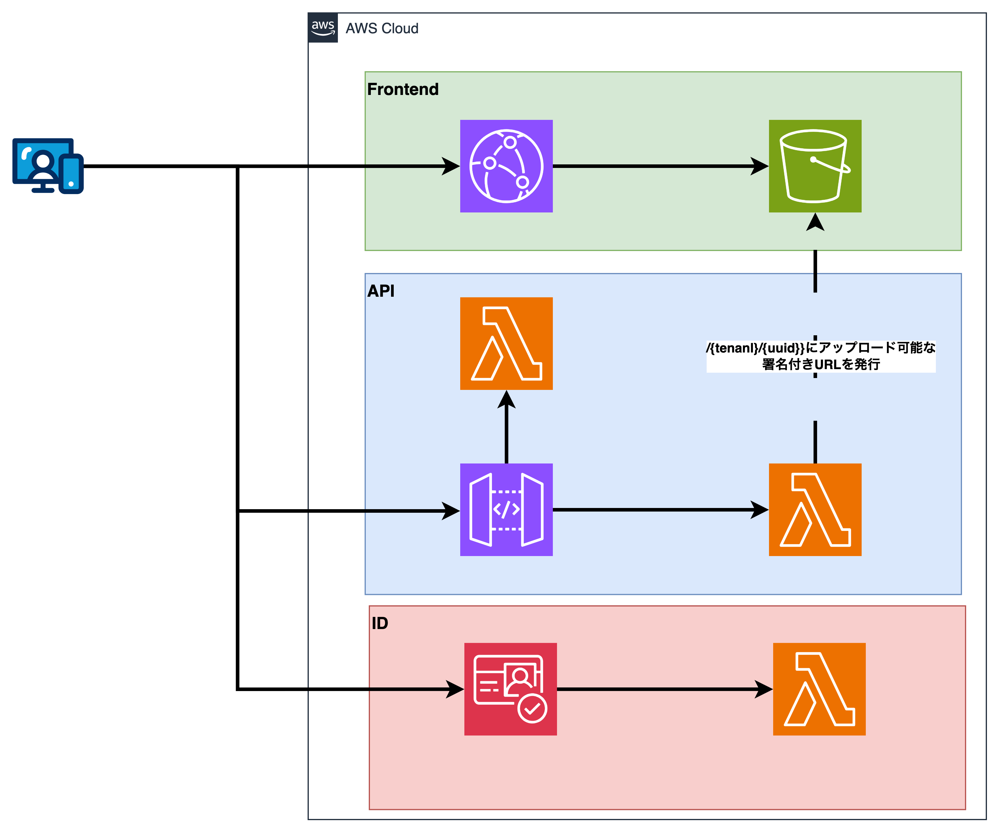

# File Box

- [File Box](#file-box)
  - [概要](#概要)
  - [構成図](#構成図)
  - [サンドボックスドメインの活用](#サンドボックスドメインの活用)
  - [ポリシーによるアクセス制御](#ポリシーによるアクセス制御)
  - [API](#api)
  - [管理者機能](#管理者機能)

## 概要

File Boxは、S3を用いたファイル共有サービスです。
ユーザーは、Cognitoのユーザーとして作成され、S3のオブジェクトに対して、署名付きURLを用いて、ファイルの追加 / 取得 / 削除を行うことができます。

## 構成図

## サンドボックスドメインの活用

File Boxでは、S3からファイルを取得 / 追加 / 削除をする際は、S3の署名付きURLを使用します。
署名付きURLを用いることで、`<bucket>.s3.<region>.amazonaws.com`をSandBox Domainとして活用でき、XSSなどの脆弱性が発生した場合の影響範囲を狭めることができます。

詳しくは、[infraのS3ファイル](./infra/S3_Bucket.md)を参照してください。

## ポリシーによるアクセス制御

IAMおよびS3Bucketのポリシーは、できる限り、最小限の権限に設定しています。
また、テナントの管理は、Cognitoの属性にテナントIDを用い、その値をS3 ObjectのPrefixとして使用することで、テナントごとにS3 Objectを分離しています。

詳しくは、[infraのS3ファイル](./infra/S3_Bucket.md)を参照してください。

## API

APIは、[API.md](./API.md)を参照してください。

## 管理者機能

`/v1/report`に対して、POSTリクエストを送信することで、管理者が確認を行います。
現時点では、実際に管理者が確認を行うことはしていませんが、模擬的に[./infra/lib/container/container/report/code/src/index.ts](./infra/lib/container/container/report/code/src/index.ts)をLambda上で実行することで、管理者が確認を行った際の動作を模倣することができます。
