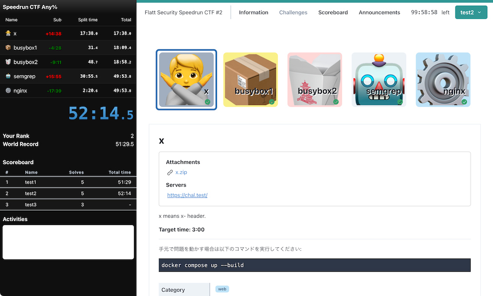

# Flatt Security Speedrun CTF #2

https://flatt.connpass.com/event/302748/

| Challenge name | Category  | Author | Solves | Target time |                                                                                                                  |
|----------------|-----------|--------|--------|-------------|------------------------------------------------------------------------------------------------------------------|
| x              | web       | akiym  | 15     | 5:00        | [Description](001/_chal/001.yml), [Attachment](001/_chal/x.zip), [Source](001), [Solution](001/_solution)        |
| busybox1       | web, misc | akiym  | 15     | 5:00        | [Description](002/_chal/002.yml), [Attachment](002/_chal/busybox1.zip), [Source](002), [Solution](002/_solution) |
| busybox2       | web, misc | akiym  | 12     | 10:00       | [Description](003/_chal/003.yml), [Attachment](003/_chal/busybox2.zip), [Source](003), [Solution](003/_solution) |
| semgrep        | web       | akiym  | 2      | 20:00       | [Description](004/_chal/004.yml), [Attachment](004/_chal/semgrep.zip), [Source](004), [Solution](004/_solution)  |
| nginx          | web       | akiym  | 0      | 20:00       | [Description](005/_chal/005.yml), [Attachment](005/_chal/nginx.zip), [Source](005), [Solution](005/_solution)    |

